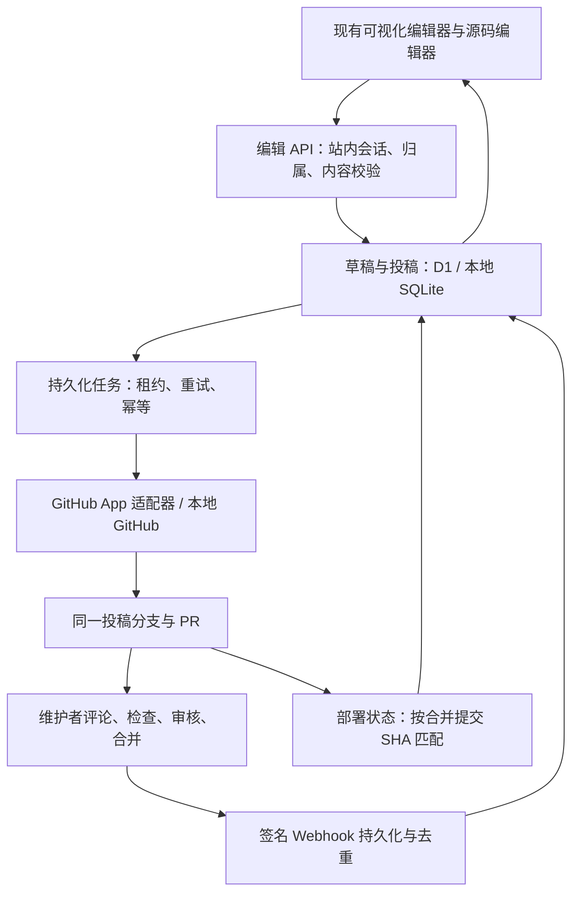

# 站内编辑与 PR：本地架构

> 2026-09-14 更新：当前开发分支已支持新建词条与保留原图的小附件。较大原图通过 GitHub 上传，路径和分类见[图片与文件教程](files-and-images.md)。以下首版/日期验收记录描述当时版本，不代表当前功能范围。

当前工作位于前后端 `codex/wiki-editor-pr` 工作树。没有推送、部署、创建 GitHub App 或线上 PR。入口复用原站内编辑器；旧 `/zh/contribute/demo/` 重定向到编辑器。

## 启动

要求 Node 24（本地 SQLite harness 使用 `node:sqlite`）。两个终端分别执行：

```sh
# 后端工作树
pnpm install
pnpm dev:editor
# 前端工作树
pnpm install
pnpm dev:editor
```

前端 http://127.0.0.1:4358，后端 http://127.0.0.1:8798。访问 `/zh/contribute/editor/?target=src%2Fcontent%2Fprojects%2Fnovels%2Fkamitsubaki-city-novelized%2Fzh.md`。`pnpm dev:editor` 设置 `PUBLIC_EDITOR_ENABLED=true` 和 `PUBLIC_EDITOR_LOCAL=true`；本地模式还要求 DEV。生产由 `PUBLIC_EDITOR_ENABLED` 控制，默认隐藏功能，URL 参数无法开启测试身份。该页面的公共账号/AI 后台初始化暂停，避免把本地联调发送到线上。

后端 `.local/editor.sqlite` 持久保存草稿、投稿、版本、任务、Webhook 和模拟 GitHub 数据；加入 gitignore。前端浏览器草稿是断网备份，PR 状态不再来自 localStorage。旧纯前端模拟记录不会冒充真实后端记录。

## 数据链路



## 已实现

- zh / ja / en 现有 artists、songs、albums、projects、logs 文件；路径白名单、YAML 解析、语言与 translationKey 校验，最多 500 KB。
- 使用服务端会话识别作者，客户端 accountId 只用于检测账号切换，不授权。所有角色都只能投稿；API 无直接合并/发布接口。
- 服务端草稿保存、恢复前对照和乐观锁；旧版本写入返回 409。草稿保留 90 天，当前编辑内容不会被后台轮询替换。
- 账号页“我的投稿”入口、投稿和评论分页、作者撤回、失败重试；账号删除清理私有投稿数据，已公开的 GitHub 历史保留。
- 每位作者每篇文章至多一个进行中的投稿。更新同一 PR，重置本版本检查和审核，保留历史评论上下文。
- 原文 SHA 检查阻止陈旧草稿覆盖新原文；站内对照原稿、最新原文、个人修改及 PR 分支内容，作者确认最终 Markdown 后再次检查版本并更新同一 PR。不会自动强推或静默解决合并冲突。
- 持久化提交任务，重启恢复、租约抢占、指数退避；GitHub 响应丢失重试时复用分支与 PR。已同步版本单独保存。
- 普通/行内/审核评论同步，行内保留原提交及 diff 上下文；Webhooks 验签去重后入库；轮询补偿漏掉的事件。
- 待审核、需要修改、已关闭、合并待部署、发布失败、已发布。真实部署适配器只读取与 merge SHA 对应的 Pages 生产部署。
- 本地 GitHub 控制台可评论、要求修改、检查通过/失败、批准、合并、模拟发布成功/失败。只有本地 Node harness 暴露 `/__local/*`，Worker 不包含该入口。
- Alice/Bob 用于本地验证服务端账号隔离。它们是虚构账号；当前浏览器未提交正文作为本机工作草稿保留，切换时提示核对。
- 无修改导出 5,271 篇现有词条逐字一致；同序内容块编辑保留原间距和未改元数据。插入/删除内容块时按编辑器标准格式重排间距。

## 本地验收

1. 修改正文 → 提交审核 → 保存服务端草稿 → 填说明 → 提交。
2. 等待 PR 编号，刷新/重启后仍可在“我的投稿”读取。
3. 模拟行内评论、要求修改；返回编辑器继续修改，提交第二版仍为原 PR。
4. 批准旧版再更新，新版应重新等待检查与批准。
5. 切换 Bob，“我的投稿”为空；直接请求 Alice 投稿被拒绝。
6. 检查通过并批准后才能在本地模拟合并；发布失败与发布成功单独显示。
7. 两标签页保存同一草稿，旧版本返回冲突；请求中断重试不重复创建 PR。

UI 验证只使用电脑操作工具的基础点击/输入/可访问性树，不使用 Playwright。

## 真实环境接线（本次不执行）

真实 GitHub App 适配器和 Worker 路由已写入后端，但未提供密钥、未启用、未调用线上写接口。以后接线需要 App 安装权限、D1 迁移、受保护主分支与检查规则、Webhook URL/secret、定时任务、Pages 只读凭据。详细变量在后端 `docs/editor-local.md`。

真实 OAuth 登录、GitHub App 权限、仓库保护与线上部署状态需要独立测试环境验收；本地模拟通过不代表这些外部配置已验证。首版暂不涵盖新建词条、图片上传、多人实时协作、站内回复 GitHub 评论；现有需求是站内看到审核评论。

## 2026-09-10 本地验收记录

- 现有 PR #1 第二版在重启后恢复，旧版审核评论保留；浏览器完成检查、批准、合并、部署失败、部署成功的后半段流程，均为 SQLite 模拟状态。
- 实际暂停本地 API：页面阻止提交，编辑正文仍在浏览器；重启后原投稿自动重新出现。
- 新增数据库关闭/重开、两标签页并发保存、并发创建/更新、原文在排队后变化、网络故障与重试、提交期间 Webhook 到达测试。
- 修复：排队后原文变化进入明确冲突状态；网络失败显示原因并提供重试入口；提交中的审核事件保留到可同步时处理；前端固定打开面板时的投稿版本，后台状态刷新不会帮助旧稿越过版本检查。
- 修复：恢复连接后清除过时的离线提示；查看“我的投稿”不再要求当前编辑正文能通过原文校验。

冲突会保留投稿内容并停止自动发送，不会自动覆盖原文或强推远程分支。真实 GitHub 和生产部署仍未启用。

本轮新增验证：无需 prDemo 参数的正常编辑入口、服务端草稿对照、三方冲突核对并生成本地模拟 PR 均通过基础浏览器操作验证。撤回确认曾触发 CUA 超时，恢复后已从 Chrome 和内置浏览器确认 PR #3 已关闭；后端重启后 PR #1 的旧评论仍可读取。撤回 API 的版本、归属和关闭行为也由自动化测试覆盖。详细最终结果见 `editor-release-review.md`。
